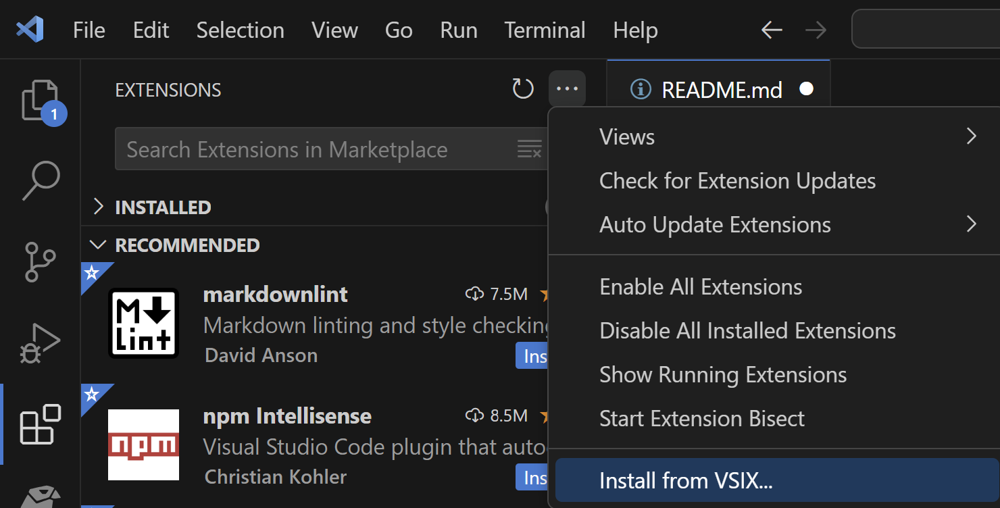

# C2000-IDEA
C2000 IDE Assist is a Visual Studio Code and Code Composer Studio Theia/20 extension that enables various tools and features for C2000 MCUs.

# How to get started
The tool is available in the CCS extension market place.

You can also downlaod the VSIX file directly from GITHUB and follow the steps below to install the extension.
https://github.com/TexasInstruments/C2000-IDEA

# How to install on VSCODE/CCS

Open the extensions tab, click on the three dot, and instal from VSIX file.

