# Table of Contents
* [C2000-IDEA](#intro)
* [Getting Started](#getting_started)
    * [Prerequisites](#prereqs)
        * [ CCS 20 Installation](#ccs_install)
        * [VSCODE Installation](#vscode_install)
    * [Installing C2000-IDEA](#extension_install)
    * [Project Detection](#project_detection)
* [Features](#features)
    * [Targeted Collateral Delivery Features](#collateral_access)
        * [Autogenerated Collateral Linking](#automatic_features)
        * [Register Vision](#register_vision)
    * [Developer Efficiency Features](#code_assist)
        * [Register Code Support](#register_code)
        * [Interrupt Code Support](#interrupt_code)
    * [Migration Support Features](#migration)
        * [Migration Settings](#migration_settings)
        * [Run Migration Check on File](#check_file)
        * [Run Migration Check on Project](#check_project)
        * [Migration Code Actions](#code_actions)
        * [Export Migration Report](#migration_report)
* [AI Agent Support (MCP Servers)](#ai_agent)
    * [IDEA MCP Server](#idea_mcp)
    * [TI ASM MCP Server](#ti_asm_mcp)
    * [AI Agent Device Migration Workflow](#ai_agent_migration)
    * [Bitfield-to-Driverlib Conversion](#ai_agent_bitfield)

<a name="intro"></a>

# C2000-IDEA

C2000 IDE Assist is a Visual Studio Code and Code Composer Studio 20 extension that enables various tools and features for C2000 MCUs. It provides an easier way to develop, debug, and migrate C2000 application code with features available in your development environment.
For more in depth details about supported features and tool usage, see the [C2000 IDE Assist Tool Features Guide](https://www.ti.com/lit/pdf/SPRADL6)
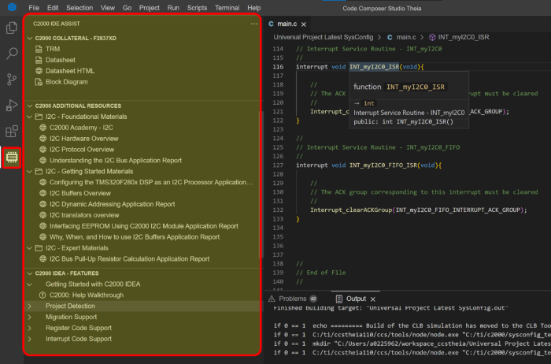
<a name="getting_started"></a>

# Getting Started 

This tool is available in the CCS extension market place. You can also download the vsix file directly from GITHUB.
https://github.com/TexasInstruments/C2000-IDEA. See detailed installation steps below.
<a name="prereqs"></a>

## Prerequisites

The C2000-IDEA extension can be used with either a Code Composer Studio 20 or VSCODE development environment. 
<a name="ccs_install"></a>

### CCS 20 Installation

(Recommended) This software allows you to not only develop your code, but also build and debug your C2000 project.

1. Download the latest software package for your OS at https://www.ti.com/tool/download/CCSTUDIO/
1. Unzip the file to your file system
1. Double click on the ccs_setup_x.exe file to launch the installer
1. Follow the Setup steps keeping all default options
    1. In "Select Components," if only working with C2000 devices, you can uncheck all options except "C2000 real-time microcontrollers"
1. Launch CCS 20 from your Start menu when installation is complete!
<a name="vscode_install"></a>

### VSCODE Installation

1. Download the VSCODE package at https://code.visualstudio.com/download
1. Launch CCS 20 from your Start menu when installation is complete!
<a name="extension_install"></a>

## Installing C2000-IDEA

1. Launch your chosen IDE
1. Open your C2000 projects and files from the Explorer tab of the side bar panel
1. Click on the Extensions tab of the side bar panel
1. All that is needed to install the C2000-IDEA extension is a VSIX file
    1. CCS 20 Usage - The VSIX file is available in the CCS extension marketplace.
    Simply search C2000 IDEA in the Open VSX Registry Search bar and install the ti-asm extension.  
      
      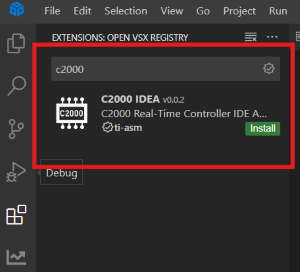
    1. VSCODE Usage - Download the latest VSIX file from this Github repository named c2000-idea-x.x.x.vsix
        1. In the Extensions tab, click the three dots at the top-right and "Install from VSIX"
1. When the C2000-IDEA extension has finished installing, you should see a new icon added to the main side bar panel.
1. Note: You may need to restart your IDE after installation if the new icon doesn't appear after a couple minutes.

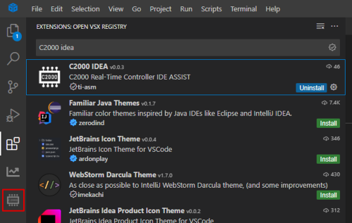
<a name="project_detection"></a>

## Project Detection

While this isn't a required setup step, running project detection for all of the projects in your CCS workspace (or VSCODE folder) will enhance the usage of many of the C2000-IDEA tools features by keeping track of which C2000 device each file is being developed for and only providing suggestions and support for peripherals relevant to the specific device. 
Many features alternatively allow the user to input their C2000 device each time a feature/command is invoked, or you may set up a default device in the Extension properties.
1. All C2000 Projects in Workspace can be detected with a single click on **C2000 IDEA** - **FEATURES** -> **Project Detection** -> **Get Projects**
2. All projects detected in the workspace will display in the **C2000 - PROJECTS** pane. This is used by the C2000-IDEA tool to keep track of all of the files in a project, and a project's current device family, device variant, and set migration device (initially empty). 

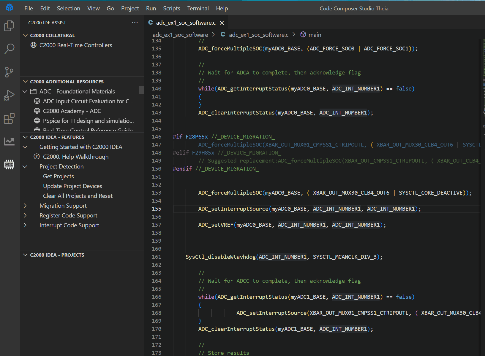
<a name="features"></a>

# Features

All features of the C2000-IDEA tool support driverlib projects for GEN 3 or GEN 4 C2000 devices. 
Select features include support for bitfield project files and specific GEN 2 C2000 devices. 
For a list of all available devices and project types supported per feature, please see section x of the Application Report (https://www.ti.com/lit/pdf/SPRADL6).
Most features can be accessed via buttons in the extension Tree View inside one of the four panes. 
Alternatively, all features can be run by invoking their related commands in your IDE by inputting Ctrl+Shift+P and typing in the name of the command. 
A more in depth list of all available features and their associated commands are listed in the Application Report ((https://www.ti.com/lit/pdf/SPRADL6). The below will go over the features available with buttons in the Tree View panes.

The C2000-IDEA tab has the following panes:
- **C2000 COLLATERAL**
- **C2000 ADDITIONAL RESOURCES**
- **C2000 IDEA - FEATURES**
- **C2000 IDEA - PROJECTS**
<a name="collateral_access"></a>

## Targeted Collateral Delivery Features

The C2000-IDEA targeted collateral delivery features will autogenerate collateral links relevant to the files and text you are actively editing in your IDE. 
Once the extension has been installed and (optionally) project detection has been run, this feature will begin populating with related links while you open and edit different files. 
No additional steps are needed to enable these features.
<a name="automatic_features"></a>

### Autogenerated Collateral Linking

- The C2000-COLLATERAL Pane contains links to the Technical Reference Manual (TRM) and datasheet from your active file's detected project. If project detection has been run successfully, the detected device family will be listed with the title of the pane.
- The C2000 ADDITIONAL RESOURCES Pane detects key words or phrases you are editing (for example C2000 peripheral names) and generates links to related collateral.
<a name="register_vision"></a>

### Register Vision

The following steps can be used to detect all device registers in a file for improved understanding of example code and seamless code development.
Register vision is available for both driverlib and bitfield code register accesses. 
1. Open a file (standalone or from a project) containing register accesses in your IDE
1. Run Register Vision
    1. If the file uses driverlib register reads and writes (using HWREG and HWREGH accesses), run **C2000 IDEA - FEATURES** -> **Register Code Support** -> **Run Driverlib Register Vision on Current File**
    1. If the file uses bitfield  register reads and writes (using .bit and .all accesses), run **C2000 IDEA - FEATURES** -> **Register Code Support** -> **Bitfield Support** -> **Run Bitfield Register Vision on Current File**
1. If no project has been detected (or if the file doesn't belong to a project), the extension will prompt you to input the C2000 device for the file
1. Detected registers will be highlighted in yellow. Hover over the highlighted registers to access direct links into each register description in the device TRM.

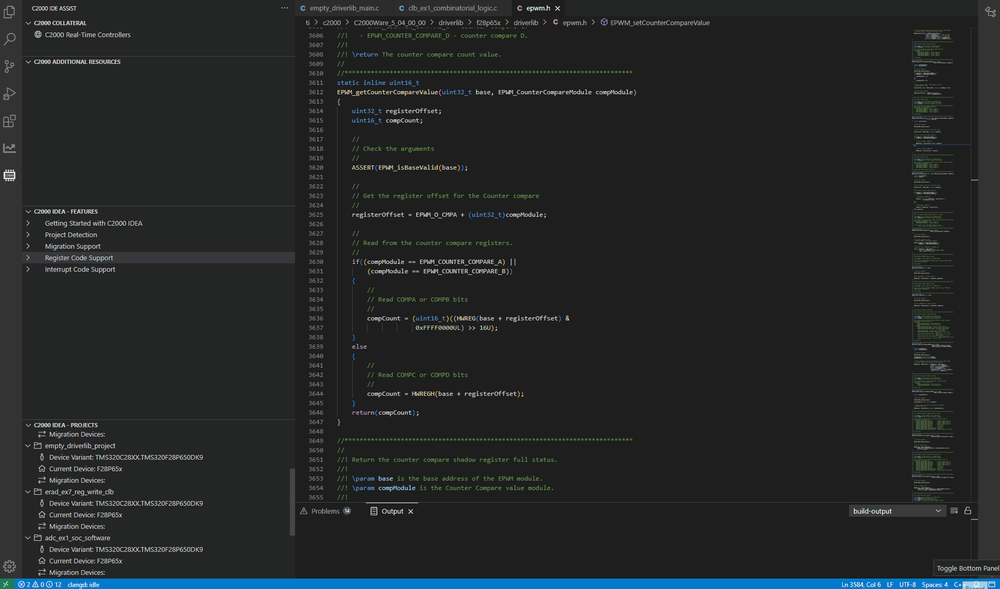
<a name="code_assist"></a>

## Developer Efficiency Features

The below code assistance features can aid in code development by autogenerating template application code and providing direct links to register descriptions during development.
<a name="register_code"></a>

### Register Code Support

The following steps can be used to generate template code to read or write to a C2000 device register using driverlib register accesses.
1. Toggle select the check box for **C2000 IDEA - FEATURES** -> **Register Code Suppor**t -> **Register Code Write/Read** to enable register code template generation
1. Open a file from your workspace where you would like to add your register access code
1. Begin typing the peripheral, register or field name inside your file to view a list of all registers and register fields to Read/Write for the current device alphabetically.
1. Select the "Read" or "Write" dropdown option for a register or specific register field 
    1. Replace the base address placeholder (ex. epwmBase) with the name of the peripheral instance base to use (ex. EPWM1_BASE)
    1. For write operations, input the value to write to the register/register field to the right of the access
    1. For read operations, input the variable to read the register/register field into to the left of the access
     
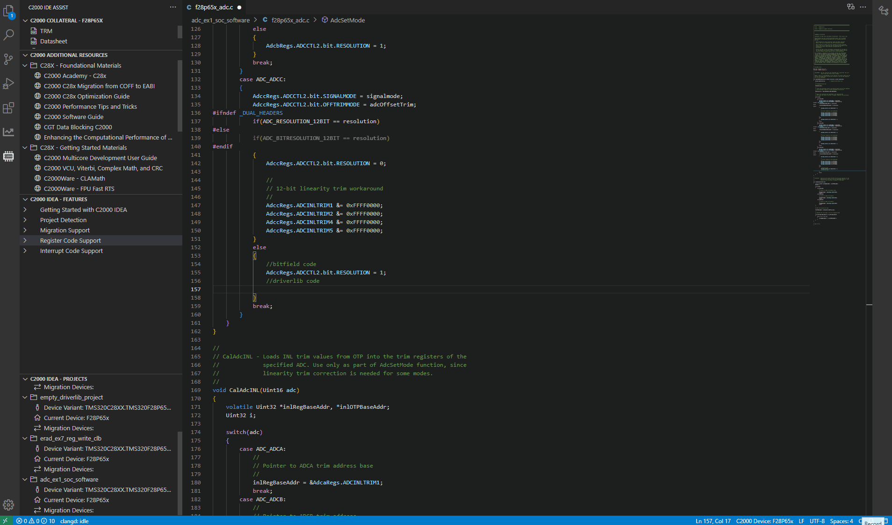
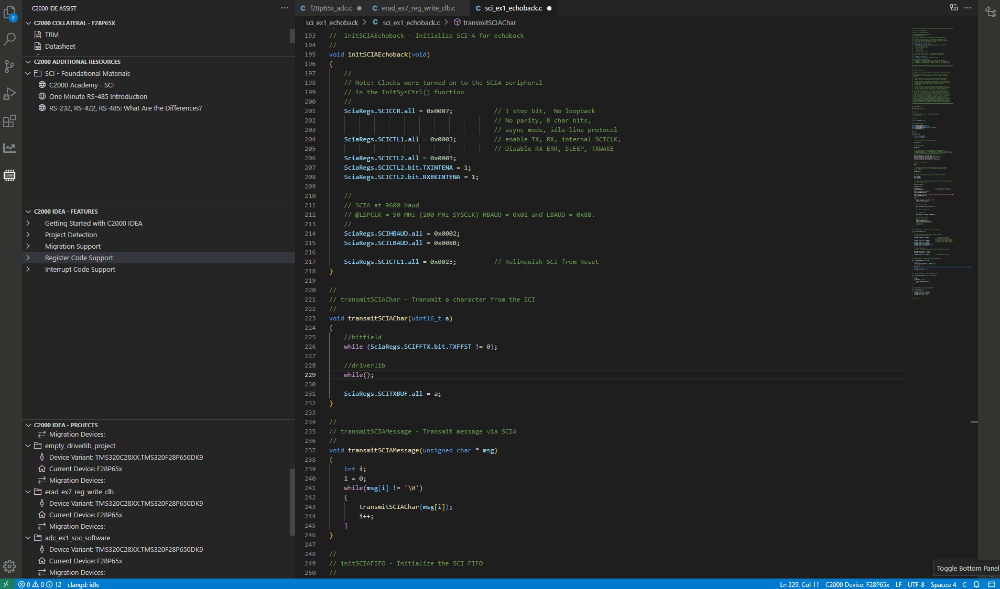
<a name="interrupt_code"></a>

### Interrupt Code Support

The following steps can be used to generate a template ISR function definition for an interrupt in the ePIE (C28x) or PIPE module (C29x).
1. Toggle select the check box for **C2000 IDEA - FEATURES** -> **Interrupt Code Support** -> **Interrupt Code Templates** to enable ISR template generation 
1. Open a file from your workspace where you would like to add an Interrupt Handler Routine (ISR)
1. Begin typing the phrase "interrupt handler 'interrupt name'" inside your file to view a list of all interrupts for the device listed alphabetically
1. Select an ePIE or PIPE peripheral interrupt
1. A template ISR for the selected interrupt will be generated inside your file. If project detection has been run for the file's project, the generated code will be specific to the current device's interrupt architecture.
1. Add application specific code inside the ISR 

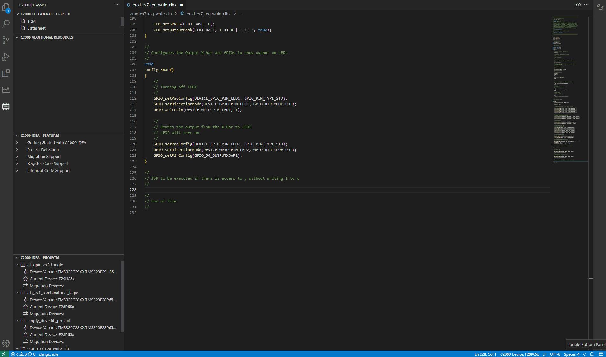
<a name="migration"></a>

## Migration Features

The following steps can be used to help migrate a driverlib project across C2000 devices.
<a name="migration_settings"></a>

### Migration Settings

1. Migration settings can be opened with a single click on **C2000 IDEA - FEATURES** -> **Migration Support** -> **Set Up Migration Settings**
2. Choose the project that needs to be migrated
3. Select a migration device for the project and customize which folder/files to ignore for the Migration check on the project
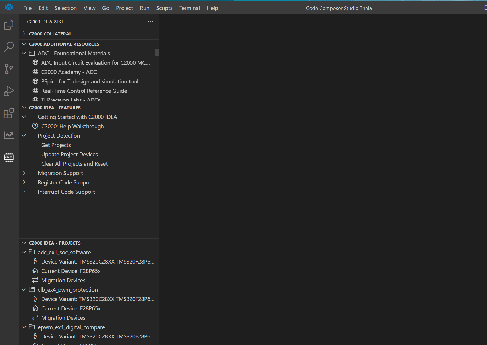

<a name="check_file"></a>

### Run Migration Check on File

1. Run a migration check on the active file in your IDE by clicking **C2000 IDEA - FEATURES** -> **Migration Support** -> **Run Migration Check on File**
2. When prompted, input the current device and migration device
2. All migration concerns detected in the file will be underlined in red. Actions to take to resolve these concerns are listed in [Migration Code Actions](#code_actions).
2. There is also a special feature which can run the migration check on the current file at regular intervals after every code edit. 
This can be enabled by toggling on the selection in **C2000 IDEA - FEATURES** -> **Migration Support** -> **Continuous Migration Check on Current File**

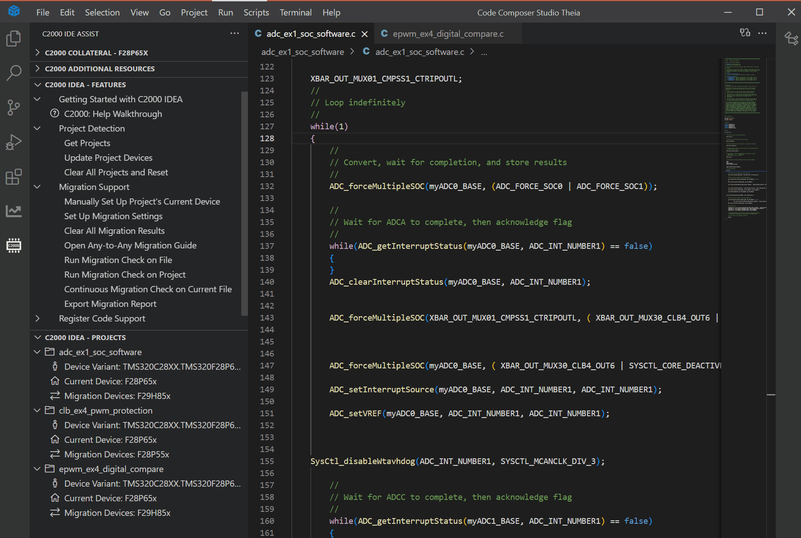
<a name="check_project"></a>

### Run Migration Check on Project

1. Migration check on a project can be performed by clicking **C2000 IDEA - FEATURES** -> **Migration Support** -> **Run Migration Check on Project**. Choose the project that needs to be migrated.
2. The tool will showcase a progress bar with necessary information on which file is being processed at the right bottom of the IDE
3. If there is any overlap of folders or files in the migration folder and files to be ignored information in Migration setup page, the tool will notify as an error.
Note: 
- Don't run other migration features while the tool is running Migration Check on project. Wait for the "Migration check completed" notification in the bottom right to proceed with using other migration features.
- The time taken to run the check for each project entirely depends on how many files, lines and code changes exist in a project. The migration report will indicate the time taken to run the migration check on each file.

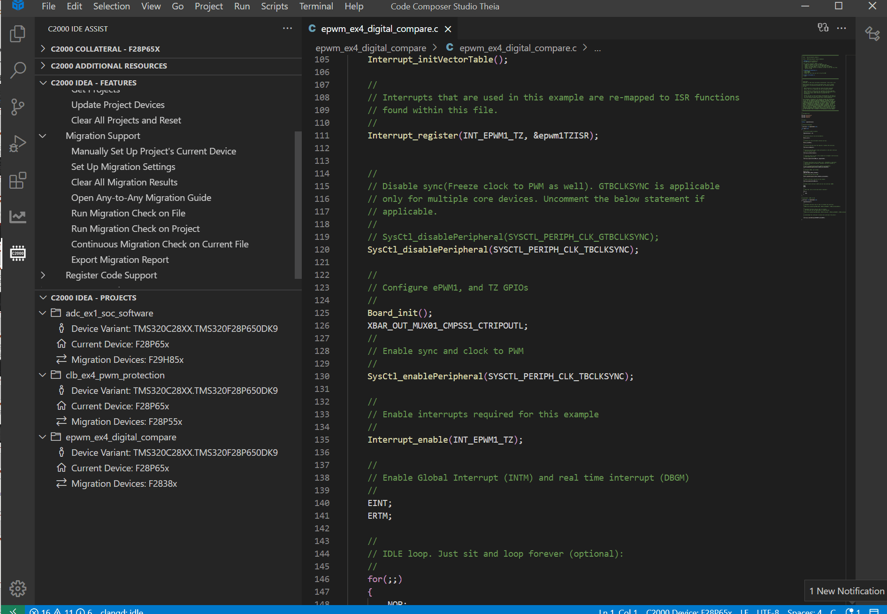
<a name="code_actions"></a>

### Migration Code Actions

1. After the migration check is run, each migration concern will be underlined in red with "View Problem" and "Quick Fix" options
2. "View Problem" will provide a message for what has changed between the two devices
3. "Quick Fix" has multiple options:   
    - View the migration collateral for the current device and migration device pair
    - Wrap code in device specific #IFDEF's for the current device and migration device so that different lines of code are compiled depending on the device define as .
    - Ignore migration related error.
    - Wrap all Enum Fixes in device specific #IFDEF's for the current device and migration device. (special scenario)

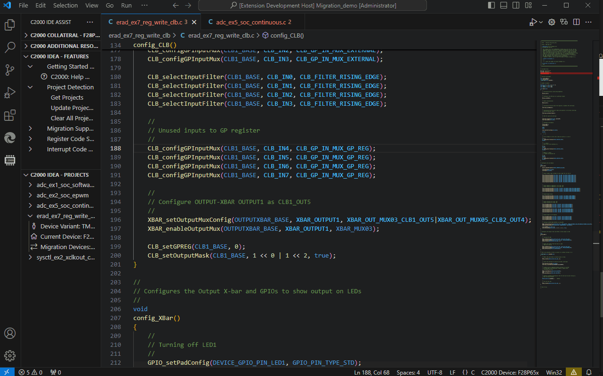
<a name="migration_report"></a>

### Export Migration Report

1. The migration report can be opened by clicking **C2000 IDEA - FEATURES** -> **Migration Support** -> **Export Migration Report**. Choose migrated project
2. The tool will open the migration report file with a default "Untitled" name. The file can be exported and stored to your file system.
    3. The migration report will contain all the migration warnings and errors detected, including their locations in the file.
   The top of the report also contains information about which files/folders were ignored (customizable) and the time taken to run the check for each file.

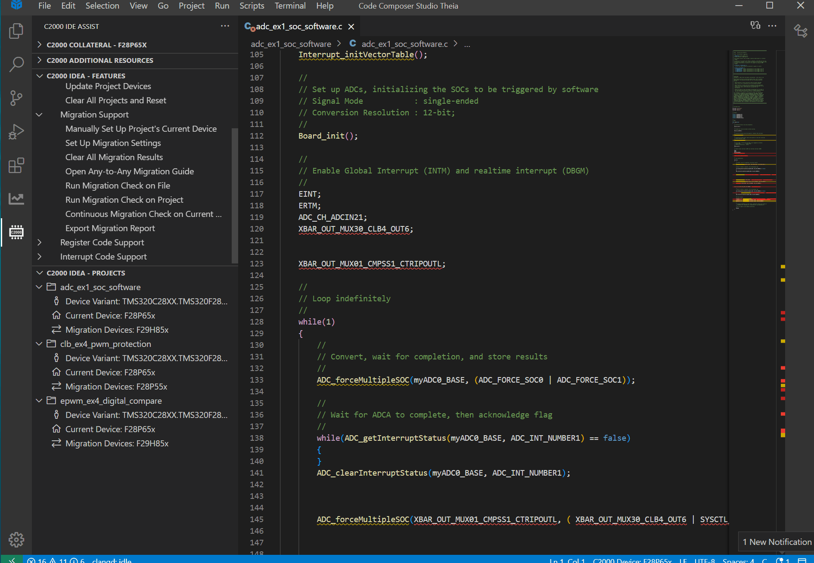
<a name="ai_agent"></a>

# AI Agent Support (MCP Servers)

C2000-IDEA includes built-in **Model Context Protocol (MCP) server** support, which allows AI coding assistants to interact directly with your C2000 projects — reading project settings, running migration analysis, querying device TRM data, and executing full device-to-device migration workflows — all from within a natural-language conversation.

> **What is an MCP server?**
> MCP (Model Context Protocol) is an open standard that lets AI agents call tools hosted by applications. When the C2000-IDEA MCP servers are running, your AI assistant gains access to C2000-specific tools it can invoke automatically as it helps you work.

## Supported AI Assistants

The following AI coding assistants work with C2000-IDEA out of the box:

| AI Assistant | Platform |
|---|---|
| **Claude Code** | CLI / VS Code |
| **GitHub Copilot** (Agent mode) | VS Code |
| **Cursor** | Cursor IDE |
| **OpenAI Codex CLI** | CLI |

You do not need to edit any config files by hand. The extension provides
**`C2000-IDEA: Register IDEA MCP`** and **`C2000-IDEA: Register TI ASM MCP`** commands that
prompt for the tool you are using and write the correct MCP configuration file automatically.
<a name="idea_mcp"></a>

## Step 1 — Enable the IDEA MCP Server

The **IDEA MCP server** is the primary interface. It gives your AI assistant access to C2000-IDEA tools such as project listing, migration report generation, and bitfield-to-driverlib conversion.

**To enable:**
1. Open the Command Palette (`Ctrl+Shift+P` or `Cmd+Shift+P` on macOS)
2. Run: **`C2000-IDEA: Enable IDEA MCP`**
3. Verify it is running: run **`C2000-IDEA: Check IDEA MCP`** — it will display the server URL (`http://localhost:55001/mcp`) when active

**To stop the server:** Run **`C2000-IDEA: Disable IDEA MCP`** from the Command Palette.

**Default URL:** `http://localhost:55001/mcp`

You can change the port or host in VS Code / CCS Settings (`Ctrl+,`) by searching for `c2000-idea`:

| Setting | Default | Description |
|---------|---------|-------------|
| `c2000-idea.ideaMcp.port` | `55001` | Port the IDEA MCP server listens on |
| `c2000-idea.ideaMcp.host` | `localhost` | Host address the IDEA MCP server binds to |

### Register the IDEA MCP server with your AI assistant

Run **`C2000-IDEA: Register IDEA MCP`** from the Command Palette and select the tool you are
using (Claude Code, Cursor, GitHub Copilot, or OpenAI Codex CLI). The extension writes the
correct MCP configuration file for that tool automatically — no manual editing required.

> **Power users:** If you prefer to configure the server yourself, run
> **`C2000-IDEA: IDEA MCP Instructions`** for a copy-ready snippet.
<a name="ti_asm_mcp"></a>

## Step 2 — Enable the TI ASM MCP Server (Optional but Recommended)

The **TI ASM MCP server** gives your AI assistant on-demand access to TI device Technical Reference Manuals (TRM) — including register definitions, bit-field descriptions, and peripheral documentation. This is especially useful during device migration when the assistant needs to verify register-level intent before constructing a replacement.

**To enable:**
1. Open the Command Palette
2. Run: **`C2000-IDEA: Enable TI ASM MCP`**

**To stop the server:** Run **`C2000-IDEA: Disable TI ASM MCP`** from the Command Palette.

**Default URL:** `http://localhost:55000/mcp`

| Setting | Default | Description |
|---------|---------|-------------|
| `c2000-idea.mcp.port` | `55000` | Port the TI ASM MCP server listens on |
| `c2000-idea.mcp.host` | `localhost` | Host address the TI ASM MCP server binds to |

**Register with your AI assistant:**
Run **`C2000-IDEA: Register TI ASM MCP`** from the Command Palette and select your tool — the
extension writes the correct configuration file automatically. Power users who prefer manual
setup can run **`C2000-IDEA: TI ASM MCP Instructions`** for a copy-ready snippet.
<a name="ai_agent_migration"></a>

## AI-Assisted Device Migration

Once both MCP servers are enabled and registered, your AI assistant can perform a **complete, end-to-end C2000 device migration** — from importing the source project all the way to a clean build on the target device — with minimal manual steps.

> This is a deeper capability than the [manual migration check](#migration). It creates a fully migrated target project, touching compiler settings, SysConfig, header files, source symbols, and linker files.

### Supported Migration Paths

| Source → Target | Status |
|---|---|
| F28x → F28x (e.g., F28003x → F28P55x, F2837xD → F28P65x) | ✅ Fully supported |
| F28x → F29x | 🚧 Coming soon |

### Migration Architecture — How It Works

> **Note:** The device names **F28003x** (source) and **F28P55x** (target) used throughout this section and the diagram below are illustrative examples only. You can use any supported C2000 source and target device pair. Refer to the [Supported Migration Paths](#ai_agent_migration) table for the list of supported combinations.

The AI agent drives a structured **6-phase workflow** (Phase 0 pre-flight + Phases 1–5). Each phase uses the IDEA MCP and supporting MCP servers to inspect the project, apply changes, verify the result, and log progress before moving to the next phase.


```mermaid
flowchart TD
    START(["▶  Start Migration\nUser: Migrate my F28003x project to F28P55x\nusing the C2000-IDEA AI migration workflow"])

    PROBE["🔍  Phase 0 — Pre-flight Check\n━━━━━━━━━━━━━━━━━━━━━━━━━━━━━━━━━━━━━━━━━━━━━━━━\nProbe 1: call get_projects() — test IDEA MCP reachability\nProbe 2: call getToolOptions() — test CCS Project MCP\nProbe 3: test TI ASM MCP  soft warning only\nGit check: confirm clean working tree · recommend migration branch\n✔  All probes pass → record session context · proceed to Phase 1\n✘  Hard stop on IDEA MCP or CCS Project MCP failure:\n     Command Palette → C2000-IDEA: Enable IDEA MCP\n     Then re-register MCP and retry probe"]

    P1["📦  Phase 1 — Project Import and Baseline\n━━━━━━━━━━━━━━━━━━━━━━━━━━━━━━━━━━━━━━━━━━━━━━━━\n1.1  Validate source project name and target device inputs\n1.2  Discover source project → device · SDK paths · build config\n1.3  Identify SDK type and resolve C2000Ware path\n1.5  Import universal driverlib example for target device\n1.6  Build imported starter → confirm zero compile errors\n1.7  Rename project to target device name  e.g. myproject_f28p55x\n1.8  Rebuild renamed project → confirm build still passes\n1.9  Create c2000-migration.md  append-only audit log\n     Records: source device · target device · active build config TBD"]

    P2["⚙️  Phase 2 — Build Settings Alignment\n━━━━━━━━━━━━━━━━━━━━━━━━━━━━━━━━━━━━━━━━━━━━━━━━\n2.0  Identify active build config  e.g. CPU1_FLASH or Debug\n     Record confirmed config in c2000-migration.md\n2.1  Align compiler flags to target device SDK\n2.2  Update predefined device symbol  F28003x → F28P55x\n2.3  Update include paths  source SDK path → target SDK path\n2.4  Update linker flags  stack · heap · map-file\n2.5  Detect linker CMD style  CMD module vs plain .cmd\n2.6  Copy application source files to target project\n2.10 Read-back diff — verify all applied settings"]

    P3["🔧  Phase 3 — SysConfig Migration  3A + 3B\n━━━━━━━━━━━━━━━━━━━━━━━━━━━━━━━━━━━━━━━━━━━━━━━━\n3A.1  Copy source .syscfg file into target project directory\n3A.2  Open target .syscfg · record source module list for audit\n3A.3  Ensure device_support module present  add if missing\n─ ─ ─ ─ ─ ─ ─ ─ ─ ─ ─ ─ ─ ─ ─ ─ ─ ─ ─ ─ ─ ─ ─ ─ ─ ─\n3B.1  Migrate device → select target device and package\n3B.2  Coverage audit → flag modules silently dropped by migrate()\n3B.3  Fix configuration errors iteratively\n3B.4  Normalize CMD module to match source linker style\n3B.5  Error gate after CMD normalization → save and close\n3B.6  Verify SysConfig outputs wired into CCS project build"]

    P4H["📄  Phase 4A — Header File Migration  per file\n━━━━━━━━━━━━━━━━━━━━━━━━━━━━━━━━━━━━━━━━━━━━━━━━\n4A.1  Replace all #include paths containing source device name\n4A.2  Update device macro guards  #ifdef F28003x → #ifdef F28P55x\n4A.3  Verify no stale source-device include paths remain"]

    P4S["📝  Phase 4B — Source File Migration  per file\n━━━━━━━━━━━━━━━━━━━━━━━━━━━━━━━━━━━━━━━━━━━━━━━━\n4B.1  Run get_device_migration_report → fix each flagged issue\n4B.2  GPIO remapping check on every .c file\n4B.3  Build after migration report is clean\n4B.4  Fix any build errors · defer cross-file errors to 4C\n4B.5  Repeat until clean build for this file"]

    P4C["🔁  Phase 4C — Final Sweep and Build Verification\n━━━━━━━━━━━━━━━━━━━━━━━━━━━━━━━━━━━━━━━━━━━━━━━━\n4C.1  Re-run migration report on all migrated files\n4C.2  Regression baseline check near all fix sites\n4C.3  Resolve deferred cross-file build errors from 4B\n4C.4  Two-pass clean rebuild  first cleans objects · second verifies\n       ✔  PASS → proceed to Phase 5\n       ✘  FAIL → dispatch Phase 4D  build error triage"]

    P4D["🔨  Phase 4D — Build Error Triage  dispatched only on FAIL\n━━━━━━━━━━━━━━━━━━━━━━━━━━━━━━━━━━━━━━━━━━━━━━━━\n4D.1  Collect current build error list via buildProject()\n4D.2  Classify each error:\n       A: missing include or file-not-found\n       B: undefined symbol\n       C: deprecated or renamed API\n       D: linker/memory-map  deferred-manual\n4D.3  Apply fixes for categories A–C\n       Uses get_device_migration_report for authoritative fixes\n4D.4  Rebuild and evaluate  max 3 triage iterations\n4D.5  Record results · return build status to orchestrator"]

    P5["📊  Phase 5 — Report and Hardware Verification\n━━━━━━━━━━━━━━━━━━━━━━━━━━━━━━━━━━━━━━━━━━━━━━━━\n5.1  Final clean build  skip if Phase 4C PASS in same session\n5.2  Structured summary: per-file table · unresolved symbols\n5.3  SysConfig status · SDK version change logged\n5.4  Bitfield register scan → flag legacy .bit/.all for follow-up\n5.5  Hardware verification checklist\n     H1 Clock tree config     H2 GPIO pinout and mux\n     H3 Peripheral base addr  H4 Interrupt routing PIE/PIPE\n     H5 Memory map linker     H6 Power domains analog subsystem\n     H7 Boot mode device cfg  H8 Debug interface JTAG"]

    DONE(["✅  Migration Complete\nTarget project builds clean on target device\nFull audit log recorded in c2000-migration.md\nMigration report and hardware checklist exported"])

    START --> PROBE
    PROBE --> P1
    P1    --> P2
    P2    --> P3
    P3    --> P4H & P4S
    P4H   --> P4C
    P4S   --> P4C
    P4C   -->|"PASS"| P5
    P4C   -->|"FAIL"| P4D
    P4D   --> P5
    P5    --> DONE

    style START fill:#C00000,color:#ffffff,stroke:#8B0000,stroke-width:2px
    style PROBE fill:#404040,color:#ffffff,stroke:#202020,stroke-width:1px
    style P1    fill:#1F497D,color:#ffffff,stroke:#17375E,stroke-width:1px
    style P2    fill:#17375E,color:#ffffff,stroke:#0F243E,stroke-width:1px
    style P3    fill:#215732,color:#ffffff,stroke:#17401E,stroke-width:1px
    style P4H   fill:#7B3F00,color:#ffffff,stroke:#5C2E00,stroke-width:1px
    style P4S   fill:#7B3F00,color:#ffffff,stroke:#5C2E00,stroke-width:1px
    style P4C   fill:#5C2E00,color:#ffffff,stroke:#3D1E00,stroke-width:1px
    style P4D   fill:#8B0000,color:#ffffff,stroke:#5C0000,stroke-width:1px
    style P5    fill:#4B0082,color:#ffffff,stroke:#320057,stroke-width:1px
    style DONE  fill:#215732,color:#ffffff,stroke:#17401E,stroke-width:2px
```

### How to Start a Migration

**Prerequisites (do this once):** Complete the [Setup Checklist](#ai_agent_local_setup) below — install CCS 20, C2000-IDEA, and your AI assistant; enable both MCP servers; and register them with your agent.

> **Safety tip (Git users only):** If your C2000 application project is version-controlled in Git, commit your current changes and create a new branch (e.g., `git checkout -b migration-to-f28p55x`) before starting, so you can roll back easily. If your project isn't in Git, you can skip this.

**Start the migration — just ask your AI assistant:**

> **Example prompt** *(substitute your own source and target device names)*:
> *"I have a C2000 F28003x project. Please migrate it to F28P55x using the C2000-IDEA migration workflow."*

The AI assistant will:
- Verify the IDEA MCP server is reachable
- Discover your projects using `get_projects()`
- Execute all five phases automatically, pausing to confirm with you before bulk changes
- Produce a `c2000-migration.md` log and a final migration report

If the AI assistant does not start the workflow automatically, invoke the migration skill
directly with its slash command:
> `/c2000-idea`
<a name="ai_agent_bitfield"></a>

## AI-Assisted Bitfield-to-Driverlib Conversion

If your project uses legacy **bitfield register access** patterns (`AdcRegs.ADCCTL1.bit.ADCBGPWD = 1`), your AI assistant can convert these to modern **driverlib function calls** (`ADC_setPowerMode(...)`) for the same device.

> **Run this before device migration.** Converting bitfield code to driverlib first reduces noise in the device migration report and produces a cleaner result.

**Ask your AI assistant:**

> *"My F28003x project uses bitfield register accesses. Please convert them to driverlib calls using C2000-IDEA."*

The assistant uses the `get_bitfield_to_driverlib_migration_report` IDEA MCP tool to identify all bitfield patterns and generate driverlib replacements. Results are shown with file locations and suggested fixes.

For technical details, see `docs/skills/c2000-idea/references/bitfield-to-driverlib-migration.md`.

---
<a name="ai_agent_local_setup"></a>

## Local Setup Guide — Running AI-Assisted Migration on Your Machine

This section provides a complete, step-by-step guide for setting up the C2000-IDEA AI migration on your local computer, including how to handle common proxy and network issues.

### Complete Setup Checklist

| Step | Action | Details |
|------|--------|---------|
| 1 | Install CCS 20 | Required to build and manage C2000 projects. Download from [ti.com/tool/CCSTUDIO](https://www.ti.com/tool/download/CCSTUDIO/) |
| 2 | Install C2000-IDEA | See [Installing C2000-IDEA](#extension_install) |
| 3 | Install your AI assistant | See the [Supported AI Assistants](#ai_agent) table above |
| 4 | Enable IDEA MCP server | Command Palette → `C2000-IDEA: Enable IDEA MCP` (or click **MCP Servers** in the status bar) |
| 5 | Enable TI ASM MCP server | Command Palette → `C2000-IDEA: Enable TI ASM MCP` (or click **MCP Servers** in the status bar) |
| 6 | Register both MCP servers | Run `C2000-IDEA: Register IDEA MCP` and `C2000-IDEA: Register TI ASM MCP`, then select your tool |
| 7 | Open your project workspace | Open your C2000 project folder in CCS 20 or VS Code |
| 8 | Start the migration | Ask your AI assistant (see [How to Start a Migration](#ai_agent_migration)) |

---

### Registering MCP Servers

Run **`C2000-IDEA: Register IDEA MCP`** and **`C2000-IDEA: Register TI ASM MCP`** from the
Command Palette and select your tool when prompted. The extension writes the correct config
file for that tool automatically (`.mcp.json` for Claude Code, `.cursor/mcp.json` for Cursor,
`.vscode/mcp.json` for GitHub Copilot, or `.codex/config.toml` for OpenAI Codex CLI).

Power users who prefer to configure the servers manually can run
**`C2000-IDEA: IDEA MCP Instructions`** or **`C2000-IDEA: TI ASM MCP Instructions`** for a
copy-ready snippet.

---

### Troubleshooting — Proxy and Network Issues

If your machine is behind a corporate proxy or firewall, you may encounter connectivity issues between your AI assistant and the C2000-IDEA MCP servers running on `localhost`. The following covers the most common scenarios.

---

#### Problem 1 — AI assistant cannot connect to `http://localhost:55001/mcp`

**Symptom:** The agent reports the MCP tool is unavailable or times out on tool calls.

**Root cause:** Some AI agents route HTTP requests through the system proxy. Many corporate proxies do not forward `localhost` / `127.0.0.1` requests correctly, causing the connection to fail.

**Resolution — add localhost to the proxy bypass list:**

- **Windows (System Proxy):**
  1. Open **Settings → Network & Internet → Proxy → Manual proxy setup**
  2. In the **"Don't use the proxy server for these addresses"** field, add: `localhost;127.0.0.1;::1`
  3. Click **Save**

- **VS Code / CCS (settings.json):**
  ```json
  "http.noProxy": "localhost,127.0.0.1,::1"
  ```

- **Environment variable (all platforms):**
  ```
  NO_PROXY=localhost,127.0.0.1,::1
  ```

---

#### Problem 2 — MCP server starts but the agent reports "connection refused"

**Possible causes and resolutions:**

| Cause | Resolution |
|-------|------------|
| Port `55001` already in use by another process | Change the port: open VS Code Settings (`Ctrl+,`), search `c2000-idea.ideaMcp.port`, set a free port (e.g., `55011`), then re-enable the server and update your agent config |
| Windows Firewall blocking the port | Add an inbound exception in **Windows Defender Firewall** for TCP port `55001` on `localhost` |
| Agent config has the wrong URL | Run `C2000-IDEA: Check IDEA MCP` in the Command Palette — it displays the exact URL the server is listening on. Update your agent config to match |

---

#### Problem 3 — Agent does not use MCP tools ("Tool not found")

**Root cause:** The MCP servers are registered but the agent session was started before the config was applied, or the agent does not support HTTP MCP transport.

**Resolution:**
1. Confirm the server is running: Command Palette → `C2000-IDEA: Check IDEA MCP`
2. Re-run `C2000-IDEA: Register IDEA MCP` and re-select your tool to rewrite the config file
3. **Restart** the agent session (close and reopen the chat or agent panel) after updating the config
4. Confirm your AI assistant supports **HTTP/SSE MCP transport** — not all agents support HTTP-based servers. Refer to your assistant's documentation.

---

#### Problem 4 — MCP server stops unexpectedly

**Expected behavior.** The IDEA MCP server and TI ASM MCP server are hosted by the C2000-IDEA VS Code extension. They run only while CCS 20 or VS Code is open with the extension active. If you close the IDE, the servers stop.

**Recommendation:** Keep CCS 20 or VS Code open throughout your AI migration session. Re-enable the servers if they stop:
- Command Palette → `C2000-IDEA: Enable IDEA MCP`  (or click **MCP Servers** in the status bar → select IDEA MCP)
- Command Palette → `C2000-IDEA: Enable TI ASM MCP`  (or click **MCP Servers** in the status bar → select TI-ASM MCP)

---

#### Problem 5 — VPN intercepts or blocks localhost traffic

**Root cause:** Some corporate VPN clients route all traffic including `localhost` through the VPN tunnel, breaking local MCP connections.

**Resolution:**
1. Add `127.0.0.1`, `localhost`, and `::1` to the **split-tunnel exclusion list** in your VPN client
2. If the VPN policy is locked by your IT department, contact IT and request a proxy bypass exception for `localhost:55001` and `localhost:55000`
3. Alternatively, change the MCP server host binding to an explicit local IP (e.g., `127.0.0.1`) by setting `c2000-idea.ideaMcp.host` to `127.0.0.1` in VS Code Settings

---

> **Quick reference — proxy bypass values to configure across all tools:**
> `localhost`, `127.0.0.1`, `::1`
