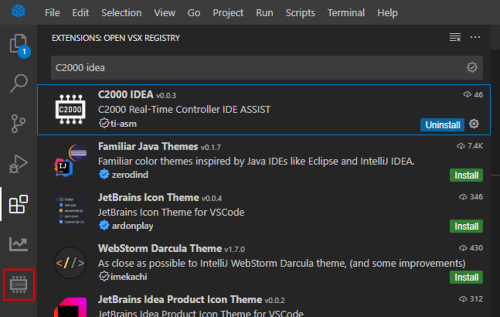

# Table of Contents
* [C2000-IDEA](#intro)
* [Getting Started](#getting_started)
    * [Prerequisites](#prereqs)
        * [ CCS Theia/20 Installation](#ccs_install)
        * [VSCODE Installation](#vscode_install)
    * [Installing C2000-IDEA](#extension_install)
    * [Project Detection](#project_detection)
* [Features](#features)
    * [Collateral Accessibility Features](#collateral_access)
    * [Code Assistance Features](#code_assist)
        * [Register Code Support](#register_code)
        * [Interrupt Code Support](#interrupt_code)
        * [Register Vision](#register_vision)
    * [Migration Features](#migration)
        * [Migration Settings](#migration_settings)
        * [Run Migration Check on File](#check_file)
        * [Run Migration Check on Project](#check_project)
        * [Migration Code Actions](#code_actions)
        * [Export Migration Report](#migration_report)

# C2000-IDEA

C2000 IDE Assist is a Visual Studio Code and Code Composer Studio Theia/20 extension that enables various tools and features for C2000 MCUs. It provides an easier way to develop, debug, and migrate C2000 application code with features available in your development environment.
For more in depth details about supported features and tool usage, see the [C2000 IDE Assist Tool Features Guide](https://www.ti.com/lit/pdf/SPRADL6)

# Getting Started 

This tool is available in the CCS extension market place. You can also downlaod the vsix file directly from GITHUB.
https://github.com/TexasInstruments/C2000-IDEA. See detailed installation steps below.

## Prerequisites

The C2000-IDEA extension can be used with either a Code Composer Studio 20 or VSCODE development environment. 

### CCS Theia/20 Installation

(Recommended) This software allows you to not only develop your code, but also build and debug your C2000 project.

1. Download the latest software package for your OS at https://www.ti.com/tool/download/CCSTUDIO-THEIA/
1. Unzip the file to your file system
1. Double click on the ccs_theia_setup_x.exe file to launch the installer
1. Follow the Setup steps keeping all default options
    1. In "Select Components," if only working with C2000 devices, you can uncheck all options except "C2000 real-time microcontrollers"
1. Launch CCS Theia from your Start menu when installation is complete!

### VSCODE Installation

1. Download the VSCODE package at https://code.visualstudio.com/download
1. Launch CCS Theia from your Start menu when installation is complete!

## Installing C2000-IDEA

1. Launch your chosen IDE
1. Open your C2000 projects and files from the Explorer tab of the side bar panel
1. Click on the Extensions tab of the side bar panel
1. All that is needed to install the C2000-IDEA extension is a VSIX file
    1. CCS Theia/20 Usage - The VSIX file is available in the CCS extension marketplace.
    Simply search C2000 IDEA in the Open VSX Registry Search bar and install the ti-asm extension.  
    1. VSCODE Usage - Download the latest VSIX file from this Github repository named c2000-idea-x.x.x.vsix
        1. In the Extensions tab, click the three dots at the top-right and "Install from VSIX"
1. When the C2000-IDEA extension has finished installing, you should see a new icon added to the main side bar panel.
1. Note: You may need to restart your IDE after installation if the new icon doesn't appear after a couple minutes.

## Project Detection

While this isn't a required setup step, running project detection for all of the projects in your CCS workspace (or VSCODE folder) will enhance the usage of many of the C2000-IDEA tools features by keeping track of which C2000 device each file is being developed for and only providing suggestions and support for peripherals relevant to the specific device. 
Many features alternatively allow the user to input their C2000 device each time a feature/command is invoked.
1. All C2000 Projects in Workspace can be detected with a single click on C2000 IDEA - FEATURES -> Project Detection -> Get Projects
2. All projects detected in the workspace will display in the C2000 - PROJECTS pane. This is used by the C2000-IDEA tool to keep track of all of the files in a project, and a project's current device family, device variant, and set migration device (initially empty). 

# Features

All features of the C2000-IDEA tool support driverlib projects for GEN 3 or GEN 4 C2000 devices. 
Select features include support for bitfield project files and specific GEN 2 C2000 devices. 
For a list of all available devices and project types supported per feature, please see section x of the Application Report (https://www.ti.com/lit/pdf/SPRADL6).
Most features can be accessed via buttons in the extension Tree View inside one of the four panes. 
Alternatively, all features can be run by invoking their related commands in your IDE by inputting Ctrl+Shift+P and typing in the name of the command. 
A more in depth list of all available features and their associated commands are listed in the Application Report ((https://www.ti.com/lit/pdf/SPRADL6). The below will go over the features available with buttons in the Tree View panes.

The C2000-IDEA tab has the following panes:
- **C2000 COLLATERAL**
- **C2000 ADDITIONAL RESOURCES**
- **C2000 IDEA - FEATURES**
- **C2000 IDEA - PROJECTS**

## Collateral Accessibility Features

The C2000-IDEA collateral accessibility features will autogenerate collateral links relevant to the files and text you are actively editing in your IDE. 
Once the extension has been installed and (optionally) project detection has been run, this feature will begin populating with related links while you open and edit different files. 
No additional steps are needed to enable these features.

- The C2000-COLLATERAL Pane contains links to the Technical Reference Manual (TRM) and datasheet from your active file's detected project. If project detection has been run successfully, the detected device family will be listed with the title of the pane.
- The C2000 ADDITIONAL RESOURCES Pane detects key words or phrases you are editing (for example C2000 peripheral names) and generates links to related collateral.

## Code Assistance Features

The below code assistance features can aid in code development by autogenerating template application code and providing direct links to register descriptions during development.

### Register Code Support

The following steps can be used to generate template code to read or write to a C2000 device register using driverlib register accesses.
1. Toggle select the check box for **C2000 IDEA - FEATURES** -> **Register Code Suppor**t -> **Register Code Write/Read** to enable register code template generation
1. Open a file from your workspace where you would like to add your register access code
1. Begin typing the peripheral, register or field name inside your file to view a list of all registers and register fields to Read/Write for the current device alphabetically.
1. Select the "Read" or "Write" dropdown option for a register or specific register field 
    1. Replace the base address placeholder (ex. epwmBase) with the name of the peripheral instance base to use (ex. EPWM1_BASE)
    1. For write operations, input the value to write to the register/register field to the right of the access
    1. For read operations, input the variable to read the register/register field into to the left of the access

### Interrupt Code Support

The following steps can be used to generate a template ISR function definition for an interrupt in the ePIE (C28x) or PIPE module (C29x).
1. Toggle select the check box for **C2000 IDEA - FEATURES** -> **Interrupt Code Support** -> **Interrupt Code Templates** to enable ISR template generation 
1. Open a file from your workspace where you would like to add an Interrupt Handler Routine (ISR)
1. Begin typing the phrase "interrupt handler 'interrupt name'" inside your file to view a list of all interrupts for the device listed alphabetically
1. Select an ePIE or PIPE peripheral interrupt
1. A template ISR for the selected interrupt will be generated inside your file. If project detection has been run for the file's project, the generated code will be specific to the current device's interrupt architecture.
1. Add application specific code inside the ISR 

### Register Vision

The following steps can be used to detect all device registers in a file for improved understanding of example code and seamless code development.
Register vision is available for both driverlib and bitfield code register accesses. 
1. Open a file (standalone or from a project) containing register accesses in your IDE
1. Run Register Vision
    1. If the file uses driverlib register reads and writes (using HWREG and HWREGH accesses), run **C2000 IDEA - FEATURES** -> **Register Code Support** -> **Run Driverlib Register Vision on Current File**
    1. If the file uses bitfield  register reads and writes (using .bit and .all accesses), run **C2000 IDEA - FEATURES** -> **Register Code Support** -> **Bitfield Support** -> **Run Bitfield Register Vision on Current File**
1. If no project has been detected (or if the file doesn't belong to a project), the extension will prompt you to input the C2000 device for the file
1. Detected registers will be highlighted in yellow. Hover over the highlighted registers to access direct links into each register descrioption in the device TRM.

## Migration Features

The following steps can be used to help migrate a driverlib project across C2000 devices.

### Migration Settings

1. Migration settings can be opened with a single click on **C2000 IDEA - FEATURES** -> **Migration Support** -> **Set Up Migration Settings**
2. Choose the project that needs to be migrated
3. Select a migration device for the project and customize which folder/files to ignore for the Migration check on the project

### Run Migration Check on File

1. Run a migration check on the active file in your IDE by clicking **C2000 IDEA - FEATURES** -> **Migration Support** -> **Run Migration Check on File**
2. When prompted, input the current device and migration device
2. All migration concerns detected in the file will be underlined in red. Actions to take to resolve these concerns are listed in [Migration Code Actions](#code_actions)
2. There is also a special feature which can run the migration check on the current file at regular intervals after every code edit. 
This can be enabled by toggling on the selection in **C2000 IDEA - FEATURES** -> **Migration Support** -> **Continuous Migration Check on Current File**

### Run Migration Check on Project

1. Migration check on a project can be performed by clicking **C2000 IDEA - FEATURES** -> **Migration Support** -> **Run Migration Check on Project**. Choose the project that needs to be migrated.
2. The tool will showcase a progress bar with necessary information on which file is being processed at the right bottom of the IDE
3. If there is any overlap of folders or files in the migration folder and files to be ignored information in Migration setup page, the tool will notify as an error.
Note: 
- Don't run other migration features while the tool is running Migration Check on project. Wait for the "Migration check completed" notification in the bottom right to proceed with using other migration features.
- The time taken to run the check for each project entirely depends on how many files, lines and code changes exist in a project. The migration report will indicate the time taken to run the migration check on each file.

### Migration Code Actions

1. After the migration check is run, each migration concern will be underlined in red with "View Problem" and "Quick Fix" options
2. "View Problem" will provide a message for what has changed between the two devices
3. "Quick Fix" has multiple options:   
    - View the migration collateral for the current device and migration device pair
    - Wrap code in device specific #IFDEF's for the current device and migration device so that different lines of code are compiled depending on the device define as .
    - Ignore migration related error.
    - Wrap all Enum Fixes in device specific #IFDEF's for the current device and migration device. (special scenario)

### Export Migration Report

1. The migration report can be opened by clicking **C2000 IDEA - FEATURES** -> **Migration Support** -> **Export Migration Report**. Choose migrated project
2. The tool will open the migration report file with a default "Untitled" name. The file can be exported and stored to your file system. 
    3. The migration report will contain all the migration warnings and errors detected, including their locations in the file.
   The top of the report also contains information about which files/folders were ignored (customizable) and the time taken to run the check for each file.

